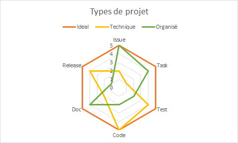

Pratiques incontournables pour les projets logiciel
===================================================

Quelles sont les pratiques incontournables des projets logiciel ? Les connaissez-vous ? Les appliquez-vous ? Savez-vous mesurer les bénéfices qu'elles apportent ? Savez-vous identifier les pertent que vous risquez à ne pas les suivre ?

Et si vous vous testiez grâce à **notre quizz** ?

Nous proposons ici une liste minimale des pratiques incontournables nécessaires à l'élaboration de n'importe quel logiciel de qualité.
Nous considérons que ces pratiques sur [ces 6 artefacts](#pourquoi-6-artefacts-) sont absoluments nécessaires pour gérer un projet logiciel de qualité.

L'objectif est ainsi de pouvoir mesurer la qualité logicielle d'un projet en fonciton de ces 6 artefacts. Vous pourrez ainsi savoir si votre projet est idéal (ou presque), s'il est bien organisé (les issues et les tâches ont une très bonne qualité, par contre le code, les tests, la doc et les release moins), ou s'il est plutôt technique (le code et les tests ont une bonne qualité mais pas les issues, les tâches, la doc et les release).

Notre approche se veut ouverte. Elle est donc matérialisée par un projet GitHub afin de favoriser tout un chacun à y participer (n'hésitez pas à envoyer vos pull-request). La [méthode employée](./METHODE.md) pour élaborer le recueil est elle aussi ouverte et clairement détaillée permettant de bien mesurer l'apport de chaque pratique.

Les Pratiques Incontournables 
===============================

* DONE [issues](./issue/)
* DONE [tâches](./tache/)
* DONE [tests](./test/)
* DONE [code source](./code/)
* DOING [documentation](./doc/)
* TODO [release](./release/)

Pourquoi 6 artefacts ?
======================

Nous considérons que tout logiciel nécessite l'élaboration d'au moins six artefacts :

* Issue
* Tache
* Test
* Code source
* Documentation
* Release

Chacun des ces artefacts est facilement identifiable par des fichiers (même si la documentation peut être incluse dans un fichier de code source, il est facile de la distinguer). 

Chaque artefact a une qualité qui lui est propre. Les pratiques incontournables que nous identifions ciblent un type d'artefact et améliorent un aspect de sa qualité.

Chaque artefact est en relation avec les autres artefact. Une pratique ciblant un artefact a donc un effet sur la qualité des autres artefacts en relation.

Chaque artefact peut être modifié permettant ainsi de faire évoluer le logiciel. Une pratique permet ainsi de préciser la façon dont les modifications doivent être réalisée pour améliorer la qualité d'un artefact.

Quelle méthode est employée pour identifier une pratique incontournable ?
=========================================================================

Notre liste des pratiques incontournables est complètement ouvert. 

Le [guide de rédaction](./METHODE.md) des pratiques décrit la méthode que nous avons utilisée. Cette méthode est elle aussi ouverte.

QUIZZ : Suivez-vous les pratiques incontournables ? 
===================================================

TODO: 

Ce qu'est le recueil de pratiques incontournables et ce qu'il n'est pas ?
=========================================================================

Notre recueil a pour objectif de lister toutes les pratiques incontournables permettant d'élaborer un logiciel de qualité. Chaque pratique listée par notre recueil est clairement détaillée et sa valeur ajoutée est rigoureusement qualifiée permettant ainsi de mesurer son effet.

Notre recueil n'est pas une nouvelle méthode expliquant les différentes étapes à réaliser pour développer un logiciel. Pour autant, certaines pratiques proposées par certaines méthodes améliorant la qualité sont référencées.

Notre recueil n'est pas un nouveau standard de qualité logiciel. La qualité logicielle ayant plusieurs définitions [Wikipedia](https://fr.wikipedia.org/wiki/Qualit%C3%A9_logicielle), notre objectif n'est absolument pas d'en définir une nouvelle. L'objectif étant de référencer les pratiques incontournables et de préciser quels aspects elles améliorent.
